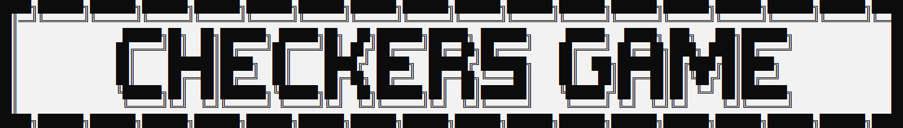
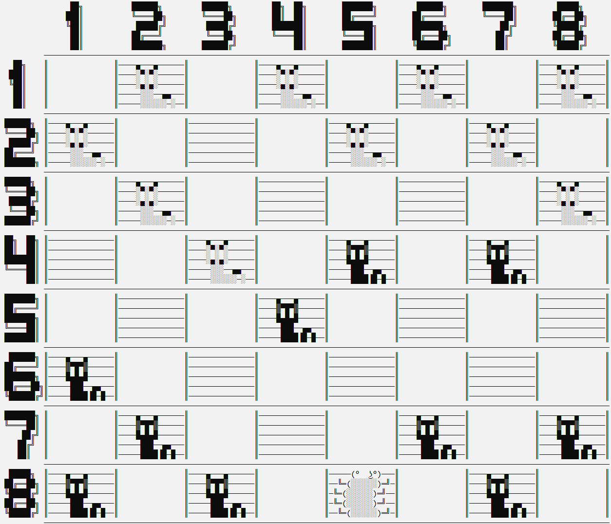

"# Checkers" 
<!-- <h1><p align="center">crt</p></h1> -->
<p align="center"></p>
<h2><p align="center">console checkers</p></h2>

---

Welcome to the console game "Checkers". This is a classic checkers game implemented in the C++ programming language that runs on the command line..

---

## Installation :
    
 ### Download or clone this repository:

```console
git clone https://github.com/feed619/Checkers.git
```

---

## Start game :

Open ```checkers.exe```. In order for the game to launch correctly and without bugs, it is recommended to run it as an administrator.


## Example

### You are player 1 and go first. Your checkers are located at the top of the board.

<p align="center"></p>

### You need to first enter the line, and then, separated by a space, the column on which your checker is located.

<p align="center"></p>

### Next, you need to enter the position to which you want to move the checker.

<p align="center"></p>
<p align="center"></p>

### After a few seconds the bot will make its move.
<p align="center"></p>

### After reaching the opponent's zone, your pawn will become a king.
<p align="center"></p>

## Feedback:

I'm always glad to hear your feedback and suggestions for improving my project. Please leave your feedback.

- [Email](mailto:feed619pro@gmail.com)